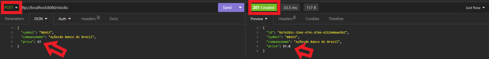
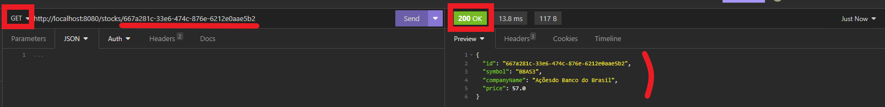

# Relatório qualidade de software - Desafio 1 Módulo Jandaia

## Índice

- .giignore
- Checkstyle
- Docker compose
- POM
- Stock Controller
  - Importações do Stock Controller
  - Modificações gerais
  - Modificações do código do Stock Controller
- RequestStockDTO
- Stock
  - Modificações gerais no Stock
  - Modificações específicas no Stock
- Stock Service
  - Modificações gerais no Stock Service
  - Modificações específicas no Stock Service
- Suit de testes automatizada
- Verificações check style
- Testes unitários

## Repositório contendo os códigos

Repositório geral:

[mandacaru broker](https://github.com/williambrunos/mandacarubroker)

Arquivo deste assessment de qualidade:

[assessment](https://github.com/williambrunos/mandacarubroker/blob/main/assessment/assessment.md)

## .gitignore

* Caminho do arquivo: .gitignore

Adicionei arquivos ``.env`` no ``.gitignore`` para que o git não rastreasse os arquivos com extensão `.env` dentro do
repositório local. Assim, eu poderia trabalhar com variáveis de ambiente sem expô-las ao repositório
remoto.

Obs: as variáveis de ambiente que utilizo são relacionadas ao container docker que utilizo para executar o
PostgreSQL da aplicação.


## Checkstyle

* Caminho do arquivo: config/checkstyle.xml

As configurações de check style abaixo foram utilizadas para padronizar a escrita do código neste projeto, seguindo as
práticas de linting e utilizando o [Checkstyle](https://checkstyle.sourceforge.io/) como ferramenta.

````XML
<?xml version="1.0"?>
<!DOCTYPE module PUBLIC
        "-//Checkstyle//DTD Checkstyle Configuration 1.3//EN"
        "https://checkstyle.org/dtds/configuration_1_3.dtd">

<!--
  Checkstyle configuration that checks the sun coding conventions from:
    - the Java Language Specification at
      https://docs.oracle.com/javase/specs/jls/se11/html/index.html
    - the Sun Code Conventions at https://www.oracle.com/java/technologies/javase/codeconventions-contents.html
    - the Javadoc guidelines at
      https://www.oracle.com/technical-resources/articles/java/javadoc-tool.html
    - the JDK Api documentation https://docs.oracle.com/en/java/javase/11/
    - some best practices
  Checkstyle is very configurable. Be sure to read the documentation at
  https://checkstyle.org (or in your downloaded distribution).
  Most Checks are configurable, be sure to consult the documentation.
  To completely disable a check, just comment it out or delete it from the file.
  To suppress certain violations please review suppression filters.
  Finally, it is worth reading the documentation.
-->

<module name="Checker">
    <!--
        If you set the basedir property below, then all reported file
        names will be relative to the specified directory. See
        https://checkstyle.org/config.html#Checker
        <property name="basedir" value="${basedir}"/>
    -->
    <property name="severity" value="error"/>

    <property name="fileExtensions" value="java, properties, xml"/>

    <!-- Excludes all 'module-info.java' files              -->
    <!-- See https://checkstyle.org/filefilters/index.html -->
    <module name="BeforeExecutionExclusionFileFilter">
        <property name="fileNamePattern" value="module\-info\.java$"/>
    </module>

    <!-- https://checkstyle.org/filters/suppressionfilter.html -->
    <module name="SuppressionFilter">
        <property name="file" value="${org.checkstyle.sun.suppressionfilter.config}"
                  default="checkstyle-suppressions.xml" />
        <property name="optional" value="true"/>
    </module>

    <!-- Checks whether files end with a new line.                        -->
    <!-- See https://checkstyle.org/checks/misc/newlineatendoffile.html -->
    <module name="NewlineAtEndOfFile"/>

    <!-- Checks that property files contain the same keys.         -->
    <!-- See https://checkstyle.org/checks/misc/translation.html -->
    <module name="Translation"/>

    <!-- Checks for whitespace                               -->
    <!-- See https://checkstyle.org/checks/whitespace/index.html -->
    <module name="FileTabCharacter"/>

    <!-- Miscellaneous other checks.                   -->
    <!-- See https://checkstyle.org/checks/misc/index.html -->
    <module name="RegexpSingleline">
        <property name="format" value="\s+$"/>
        <property name="minimum" value="0"/>
        <property name="maximum" value="0"/>
        <property name="message" value="Line has trailing spaces."/>
    </module>

    <!-- Checks for Headers                                -->
    <!-- See https://checkstyle.org/checks/header/index.html   -->
    <!-- <module name="Header"> -->
    <!--   <property name="headerFile" value="${checkstyle.header.file}"/> -->
    <!--   <property name="fileExtensions" value="java"/> -->
    <!-- </module> -->

    <module name="TreeWalker">

        <!-- Checks for Javadoc comments.                     -->
        <!-- See https://checkstyle.org/checks/javadoc/index.html -->
        <module name="InvalidJavadocPosition"/>
        <module name="JavadocMethod"/>
        <module name="JavadocType"/>
        <module name="JavadocVariable"/>
        <module name="JavadocStyle"/>
        <module name="MissingJavadocMethod"/>

        <!-- Checks for Naming Conventions.                  -->
        <!-- See https://checkstyle.org/checks/naming/index.html -->
        <module name="ConstantName"/>
        <module name="LocalFinalVariableName"/>
        <module name="LocalVariableName"/>
        <module name="MemberName"/>
        <module name="MethodName"/>
        <module name="PackageName"/>
        <module name="ParameterName"/>
        <module name="StaticVariableName"/>
        <module name="TypeName"/>

        <module name="AbbreviationAsWordInName"/>

        <!-- Checks for imports                              -->
        <!-- See https://checkstyle.org/checks/imports/index.html -->
        <module name="AvoidStarImport"/>
        <module name="IllegalImport"/> <!-- defaults to sun.* packages -->
        <module name="RedundantImport"/>
        <module name="UnusedImports">
            <property name="processJavadoc" value="false"/>
        </module>

        <!-- Checks for Size Violations.                    -->
        <!-- See https://checkstyle.org/checks/sizes/index.html -->
        <module name="MethodLength"/>
        <module name="ParameterNumber"/>

        <!-- Checks for whitespace                               -->
        <!-- See https://checkstyle.org/checks/whitespace/index.html -->
        <module name="EmptyForIteratorPad"/>
        <module name="GenericWhitespace"/>
        <module name="MethodParamPad"/>
        <module name="NoWhitespaceAfter"/>
        <module name="NoWhitespaceBefore"/>
        <module name="OperatorWrap"/>
        <module name="ParenPad"/>
        <module name="TypecastParenPad"/>
        <module name="WhitespaceAround"/>

        <!-- Modifier Checks                                    -->
        <!-- See https://checkstyle.org/checks/modifier/index.html -->
        <module name="ModifierOrder"/>
        <module name="RedundantModifier"/>

        <!-- Checks for blocks. You know, those {}'s         -->
        <!-- See https://checkstyle.org/checks/blocks/index.html -->
        <module name="AvoidNestedBlocks"/>
        <module name="EmptyBlock"/>
        <module name="LeftCurly"/>
        <module name="NeedBraces"/>
        <module name="RightCurly"/>

        <!-- Checks for common coding problems               -->
        <!-- See https://checkstyle.org/checks/coding/index.html -->
        <module name="EmptyStatement"/>
        <module name="EqualsHashCode"/>
        <module name="HiddenField"/>
        <module name="IllegalInstantiation"/>
        <module name="InnerAssignment"/>
        <module name="MagicNumber"/>
        <module name="MissingSwitchDefault"/>
        <module name="MultipleVariableDeclarations"/>
        <module name="SimplifyBooleanExpression"/>
        <module name="SimplifyBooleanReturn"/>

        <!-- Checks for class design                         -->
        <!-- See https://checkstyle.org/checks/design/index.html -->
        <module name="DesignForExtension"/>
        <module name="FinalClass"/>
        <module name="HideUtilityClassConstructor"/>
        <module name="InterfaceIsType"/>
        <module name="VisibilityModifier"/>

        <!-- Miscellaneous other checks.                   -->
        <!-- See https://checkstyle.org/checks/misc/index.html -->
        <module name="ArrayTypeStyle"/>
        <module name="FinalParameters"/>
        <module name="TodoComment"/>
        <module name="UpperEll"/>

        <!-- https://checkstyle.org/filters/suppressionxpathfilter.html -->
        <module name="SuppressionXpathFilter">
            <property name="file" value="${org.checkstyle.sun.suppressionxpathfilter.config}"
                      default="checkstyle-xpath-suppressions.xml" />
            <property name="optional" value="true"/>
        </module>

    </module>

</module>
````

## Docker compose

* Caminho do arquivo: **docker-compose.yaml**

Criei um arquivo ``docker-compose.yaml`` para configurar um container docker contendo o postgreSQL 
necessário para executar a aplicação localmente. Perceba que as configurações do container possuem
variáveis de ambiente descritas no arquivo ``.env`` ignorado pelo `.gitignore`.

Obs: o container fica hospedado localmente na máquina de quem executa a aplicação, na porta 5432. 
No entanto, como se trata de um container, o mesmo poderia ser facilmente migrado para um outro
ambiente de desenvolvimento, certificação ou produção.

````YAML
services:
  db:
    image: postgres
    restart: always
    environment:
      POSTGRES_DB: ${MANDACARU_POSTGRES_DB}
      POSTGRES_USER: ${MANDACARU_POSTGRES_USER}
      POSTGRES_PASSWORD: ${MANDACARU_POSTGRES_PASSWORD}
    ports:
      - "${MANDACARU_POSTGRES_PORT}:5432"
````

## POM

* Caminho do arquivo: pom.xml

Neste arquivo, apenas atualizo a versão do spring boot utilizada de 3.2.1 para 3.2.2
a fim de utilizar uma versão mais recente e estável.

Além disso, adiciono uma outra dependência a fim de conseguirmos executar o check style com sucesso no projeto:

````XML
<dependency>
    <groupId>com.puppycrawl.tools</groupId>
    <artifactId>checkstyle</artifactId>
    <version>10.13.0</version>
</dependency>
````


## StockController

* Caminho do arquivo: **src/main/java/com/mandacarubroker/controller/StockController.java**

### Importações do StockController

Dentro do código do ``StockController.java``, inicialmente corrijo os imports feitos. Se você puder notar,
na versão antiga do código os pacotes eram importados de maneira genérica, utilizando o "*". Assim,
de forma a mantermos as boas práticas de escrita de códigos, a fim de eliminar importações genéricas e 
manter a rastreabilidade dos nossos pacotes, refatorei o código de maneira a importar apenas os pacotes
necessários e utilizados na aplicação.


Se você observar bem, poderá notar a presença das seguintes importações:

````java
import org.slf4j.Logger;
import org.slf4j.LoggerFactory;
````

As importações citadas servirão para criarmos logs dentro do nosso código a fim de mantermos a
observabilidade da solução.

### Modificações gerais

De forma geral, tanto a classe do StockController, quanto seus parâmetros e métodos possuem
uma documentação no formato **Java Doc**. Além disso, todos os parâmetros foram escritos como
``final``, para que os mesmos não possam ter seus valores modificados ou suas referências alteradas,
seguindo as boas práticas de segurança.

### Modificações do código do StockController

Dentro da classe do StockController, inicializo o objeto ``logger`` citado anteriormente. Além disso,
crio um método construtor para a classe ``StockController``, de forma a inicializar um client do `StockService`
dentro do código.

Além disso, crio dois métodos utilitários:

* ``isValidId``: verifica se o ID da ação passado como parâmetro é vazio ou nulo;
* ``stockExists``: verifica se uma ação com o ID informado existe dentro do banco de dados.


Adicionei um logger dentro do método de ``getAllStocks`` para manter a observabilidade.

Reestruturei o método ``getStockById`` para retornar um código HTTP 200 (OK) de sucesso caso seja possível
retornar a ação com o ID especificado, ou um código HTTP 404 (Not Found) caso contrário.

Da mesma forma, resstruturei o método ``createStock`` para verificar se o preço da ação fornecido como input é
maior ou igual a zero, retornando um código HTTP 400 (Bad Request) caso contrário. Além disso, o método retorna
um código HTTP 201 (Created) ao invés de um 200 (Ok), para manter bem a rastreabilidade e legibilidade dos retornos 
da API.


Ademais, dentro do método ``updateStock``, adicionei verificações para checar se o ID fornecido para atualização é
válido e se o mesmo existe dentro do banco de dados. Caso o ID fornecido seja inválido, a API retornará um código
HTTP 400 (Bad Request). Caso o ID fornecido não corresponda a nenhuma ação do banco de dados, a API
retornará um código HTTP 404 (Not Found).

Por fim, caso o ID passe nas verificações, os dados serão atualizados e a API retornará um código HTTP 201 (Created), 
além de retornar os dados atualizados.


Da mesma maneira, dentro do método ``deleteStock``, adicionei as mesmas verificações de validação e existência
de ID. Assim, caso o ID não seja válido a API retornará um código 400, caso o ID seja de uma ação
inexistente a API retornará um código 404, e caso a deleção seja feita com sucesso a API retornará um código 200.


## RequestStockDTO

* Caminho do arquivo: src/main/java/com/mandacarubroker/domain/stock/RequestStockDTO.java

Dentro do arquivo ``RequestStockDTO.java``, modifiquei o padrão do regex do parâmetro `symbol` para que o mesmo estivesse
dentro dos padrões de símbolos de ativos da B3:

1. Prefixo: O prefixo indica o tipo de ativo. Por exemplo:

    * "ON" para ações ordinárias (direito a voto)
    * "PN" para ações preferenciais (com prioridade no recebimento de dividendos)
    * "UNT" para units, que são pacotes de ações negociados em conjunto
    Código da Empresa: Este é o código que identifica a empresa emissora do ativo. Geralmente, 
    são as primeiras quatro letras do nome da empresa.

2. Número Sequencial: O número sequencial é adicionado ao final do código da empresa para diferenciar os diferentes 
tipos de ações da mesma empresa. Por exemplo, SANB3 e SANB4.

3. Tipo Especial: Algumas ações podem ter um sufixo especial para indicar características específicas, como:

    * "F" para ações com direito de tag along diferenciado
    * "B" para ações com direito de voto restrito
    * "N1", "N2" ou "N3" para indicar níveis diferenciados de governança corporativa

4. Séries Especiais: Em alguns casos, podem ser criadas séries especiais de ações, como aquelas relacionadas a 
programas de incentivo de longo prazo para funcionários. Essas séries podem ter uma nomenclatura diferente, 
mas ainda seguem o padrão geral da B3.


## Stock

* Caminho do arquivo: **src/main/java/com/mandacarubroker/domain/stock/Stock.java**

Da mesma maneira que na classe do ``StockController.java``, ajustei os imports da classe
``Stock.java`` para remover os imports genéricos, importando assim apenas os pacotes necessários e
utilizados dentro da aplicação. Além disso, adiciono o pacote de loggers para manter a observabilidade
do código.


### Modificações genéricas no Stock

* Adição de documentações da classe, parâmetros e métodos em formato java doc
* Adição de loggers para manter observabilidade da aplicação
* Adição de palavra chave ``final`` nos parâmetros dos métodos para que os mesmos não possam mudar de valor e nem de referência dentro da aplicação

### Modificações específicas no Stock

Modifiquei o método construtor da classe ``Stock`` para que o preço da ação informado seja sempre
o preço bruto total da ação, e não a variação positiva ou negativa do preço. Assim, ao invés do preço ser
calculado pelo método ``changePrice``, ele é apenas atribuído ao atributo da classe `Stock`.


Dentro do método `changePrice`, modifiquei a lógica da estrutura condicional para apenas checar se o parâmetro
``increase`` é True ou False, aumentando ou diminuindo o preço da ação conforme o mesmo valor:

````java
public double changePrice(final double amount, final boolean increase) {
    logger.info("Changing price for stock: {}", this.symbol);
    double newPrice;
    if (increase) {
        newPrice = increasePrice(amount);
    } else {
        newPrice = decreasePrice(amount);
    }
    logger.info("New price for stock {}: {}", this.symbol, newPrice);
    return newPrice;
}
````


Dentro dos métodos `increasePrice` e `decreasePrice`, adicionei validações dos valores de preço e loggers de observação,
apenas.


## Stock Service

* Caminho do arquivo: **src/main/java/com/mandacarubroker/service/StockService.java**

### Modificações genéricas no Stock Service

* Adição de documentações da classe, atributos e métodos em formato java doc
* Adição de loggers para manter observabilidade da aplicação
* Adição de palavra chave ``final`` nos parâmetros dos métodos para que os mesmos não possam mudar de valor e nem de referência dentro da aplicação

### Modificações específicas no Stock Service

Dentro do código do ``StockService.java``, inicialmente corrijo os imports feitos. Se você puder notar,
na versão antiga do código os pacotes eram importados de maneira genérica, utilizando o "*". Assim,
de forma a mantermos as boas práticas de escrita de códigos, a fim de eliminar importações genéricas e
manter a rastreabilidade dos nossos pacotes, refatorei o código de maneira a importar apenas os pacotes
necessários e utilizados na aplicação.


Dentro da classe ``StockService``, adicionei um método construtor para realizar a instanciação do objeto do logger.
Além disso, criei um método construtor para a classe de forma a modificar o nome do parâmetro para não ficar igual ao
nome do atributo da classe.


Ademais, adicionei uma lógica no método ``createStock`` para que seja possível retornar os dados criados pela API
ao cliente. Além disso, criei um novo método ``stockExists`` para checar se uma ação com determinado ID existe no banco
de dados, método este utilizado em outras verificações do controller previamente citadas.


## Suit de testes automatizada

* Caminho do arquivo: **src/test/java/com/mandacarubroker/MandacarubrokerApplicationTests.java**

Além disso, seguindo a metodologia TDD e também para facilitar o desenvolvimento e homologação das modificações previamente descritas,
realizei a construção de uma suit de testes para a aplicação, realizando a verificação de diversos cenários
de testes unitários.

Os cenários verificados nos testes são:
* `shouldGetAllStocks`: Verifica se é possível obter todos as ações.
* `shouldNotGetStockByInexistentId`: Verifica se não é possível obter um stock com um ID inexistente.
* `shouldCreateStock`: Verifica se é possível criar uma nova ação.
* `shouldNotAllowCreateStockWithNonPositivePrice`: Verifica se não é possível criar uma ação com preço não positivo.
* `shouldNotAllowCreateStockWithZeroValueOnPrice`: Verifica se não é possível criar uma ação com preço zero.
* `shouldReturnDataAfterCreate`: Verifica se os dados retornados após a criação de uma ação estão com estrutura correta.
* `shouldReturnSuccessfulCodeAfterGetAllStocks`: Verifica se o código de retorno após obter todas as alções é bem-sucedido (200).
* `shouldReturnCreatedCodeAfterCreatedStockData`: Verifica se o código de retorno após a criação de dados de uma ação é "created" (201).
* `shouldReturnNotFoundWhenIdNotFoundOnGetData`: Verifica se o código de retorno é "not found" (404) quando o ID não é encontrado ao obter dados.
* `shouldReturnNotAllowedWhenIdNotFoundOnPostData`: Verifica se o código de retorno é "not allowed" (400) quando o ID não é encontrado ao postar dados.
* `shouldReturnNotFoundWhenIdNotFoundOnPutData`: Verifica se o código de retorno é "not found" (404) quando o ID não é encontrado ao atualizar dados.
* `shouldReturnNotFoundWhenIdNotFoundOnDeleteData`: Verifica se o código de retorno é "not found" (404) quando o ID não é encontrado ao excluir dados.
* `shouldUpdateStockById`: Verifica se é possível atualizar uma ação por ID.
* `shouldNotUpdateStockByInexistentId`: Verifica se não é possível atualizar uma ação com um ID inexistente.
* `shouldDeleteStockById`: Verifica se é possível excluir uma ação por ID.
* `shouldNotAllowDeleteAllStocks`: Verifica se não é possível excluir todas as ações.

````java
package com.mandacarubroker;

import org.junit.jupiter.api.Test;
import org.springframework.beans.factory.annotation.Autowired;
import org.springframework.boot.test.autoconfigure.web.servlet.AutoConfigureMockMvc;
import org.springframework.boot.test.context.SpringBootTest;
import org.springframework.http.MediaType;
import org.springframework.test.web.servlet.MockMvc;
import org.springframework.test.web.servlet.request.MockMvcRequestBuilders;
import org.springframework.test.web.servlet.result.MockMvcResultMatchers;

@SpringBootTest
@AutoConfigureMockMvc
class StockControllerTests {

    @Autowired
    private MockMvc mockMvc;

    @Test
    void shouldGetAllStocks() throws Exception {
        mockMvc.perform(MockMvcRequestBuilders.get("/stocks"))
                .andExpect(MockMvcResultMatchers.status().isOk());
    }

    @Test
    void shouldNotGetStockByInexistentId() throws Exception {
        mockMvc.perform(MockMvcRequestBuilders.get("/stocks/{id}", "teste_falha"))
                .andExpect(MockMvcResultMatchers.status().isNotFound());
    }

    @Test
    void shouldCreateStock() throws Exception {
        mockMvc.perform(MockMvcRequestBuilders.post("/stocks")
                        .contentType(MediaType.APPLICATION_JSON)
                        .content("{ \"companyName\": \"Test Stock\", \"symbol\": \"SANB4\", \"price\":  45.2}"))
                .andExpect(MockMvcResultMatchers.status().isCreated());
    }

    @Test
    void shouldNotAllowCreateStockWithNonPositivePrice() throws Exception {
        mockMvc.perform(MockMvcRequestBuilders.post("/stocks")
                        .contentType(MediaType.APPLICATION_JSON)
                        .content("{ \"companyName\": \"Test Stock\", \"symbol\": \"SANB4\", \"price\":  -10}"))
                .andExpect(MockMvcResultMatchers.status().isBadRequest());
    }

    @Test
    void shouldNotAllowCreateStockWithZeroValueOnPrice() throws Exception {
        mockMvc.perform(MockMvcRequestBuilders.post("/stocks")
                        .contentType(MediaType.APPLICATION_JSON)
                        .content("{ \"companyName\": \"Test Stock\", \"symbol\": \"SANB4\", \"price\":  0}"))
                .andExpect(MockMvcResultMatchers.status().isBadRequest());
    }

    @Test
    void shouldReturnDataAfterCreate() throws Exception {
        mockMvc.perform(MockMvcRequestBuilders.post("/stocks")
                        .contentType(MediaType.APPLICATION_JSON)
                        .content("{ \"companyName\": \"Test Stock\", \"symbol\": \"SANB4\", \"price\":  45.2}"))
                .andExpect(MockMvcResultMatchers.status().isCreated())
                .andExpect(MockMvcResultMatchers.jsonPath("$.companyName").value("Test Stock"))
                .andExpect(MockMvcResultMatchers.jsonPath("$.symbol").value("SANB4"))
                .andExpect(MockMvcResultMatchers.jsonPath("$.price").value(45.2));
    }

    @Test
    void shouldReturnSuccessfulCodeAfterGetAllStocks() throws Exception {
        mockMvc.perform(MockMvcRequestBuilders.get("/stocks"))
                .andExpect(MockMvcResultMatchers.status().isOk());
    }

    @Test
    void shouldReturnCreatedCodeAfterCreatedStockData() throws Exception {
        mockMvc.perform(MockMvcRequestBuilders.post("/stocks")
                        .contentType(MediaType.APPLICATION_JSON)
                        .content("{ \"companyName\": \"Test Stock\", \"symbol\": \"SANB4\", \"price\":  45.2}"))
                .andExpect(MockMvcResultMatchers.status().isCreated());
    }

    @Test
    void shouldReturnNotFoundWhenIdNotFoundOnGetData() throws Exception {
        mockMvc.perform(MockMvcRequestBuilders.get("/stocks/{id}", "non_existing_id"))
                .andExpect(MockMvcResultMatchers.status().isNotFound());
    }

    @Test
    void shouldReturnNotAllowedWhenIdNotFoundOnPostData() throws Exception {
        mockMvc.perform(MockMvcRequestBuilders.post("/stocks/{id}", "non_existing_id")
                        .contentType(MediaType.APPLICATION_JSON)
                        .content("{ \"companyName\": \"Test Stock\", \"symbol\": \"SANB4\", \"price\":  45.2}"))
                .andExpect(MockMvcResultMatchers.status().isMethodNotAllowed());
    }

    @Test
    void shouldReturnNotFoundWhenIdNotFoundOnPutData() throws Exception {
        mockMvc.perform(MockMvcRequestBuilders.put("/stocks/{id}", "non_existing_id")
                        .contentType(MediaType.APPLICATION_JSON)
                        .content("{ \"companyName\": \"Test Stock\", \"symbol\": \"TST4\", \"price\":  45}"))
                .andExpect(MockMvcResultMatchers.status().isNotFound());
    }

    @Test
    void shouldReturnNotFoundWhenIdNotFoundOnDeleteData() throws Exception {
        mockMvc.perform(MockMvcRequestBuilders.delete("/stocks/{id}", "non_existing_id"))
                .andExpect(MockMvcResultMatchers.status().isNotFound());
    }


    @Test
    void shouldUpdateStockById() throws Exception {
        mockMvc.perform(MockMvcRequestBuilders.put("/stocks/{id}", "f19197c4-38be-462c-a99f-4d32e91c74f3")
                        .contentType(MediaType.APPLICATION_JSON)
                        .content("{ \"companyName\": \"Test Stock\", \"symbol\": \"TST4\", \"price\":  45}"))
                .andExpect(MockMvcResultMatchers.status().isCreated());
    }

    @Test
    void shouldNotUpdateStockByInexistentId() throws Exception {
        // Perform a PUT request with a non-existent ID
        mockMvc.perform(MockMvcRequestBuilders.put("/stocks/{id}", "")
                        .contentType(MediaType.APPLICATION_JSON)
                        .content("{ \"name\": \"Updated Stock\", \"symbol\": \"UPD\" }"))
                .andExpect(MockMvcResultMatchers.status().isNotFound());
    }

    @Test
    void shouldDeleteStockById() throws Exception {
        mockMvc.perform(MockMvcRequestBuilders.delete("/stocks/{id}", "1b1ab7e8-bf1c-4cbf-98a9-94288e04fb87"))
                .andExpect(MockMvcResultMatchers.status().isOk());
    }

    @Test
    void shouldNotAllowDeleteAllStocks() throws Exception {
        mockMvc.perform(MockMvcRequestBuilders.delete("/stocks"))
                .andExpect(MockMvcResultMatchers.status().isMethodNotAllowed());
    }
}
````
## Verificações check style

Como é possível perceber pelos prints das execuções do checkstyle nas classes, todas as regras de linting
e padronização de código estão sendo atendidas.

### Checkstyle DTO


### Checkstyle Stock


### Checkstyle Stock Controller


### Checkstyle Stock Service


## Testes unitários

### Realização método get all stocks - GET

Ao executarmos um método GET na rota ``/stocks`` sem nenhum ID, podemos observar como retorno
uma lista com todas as ações do banco e um código HTTP 200 (OK):


### Realizando método get stock com ID - GET

Ao executarmos um método GET na rota ``/stocks`` com um ID específico, podemos observar como retorno
uma lista com a ação que possui o ID fornecido no banco e um código HTTP 200 (OK):


### Criação de ação via API - POST

Aqui realizamos a criação de uma ação via método POST na API, podemos observar que o retorno da API
consiste em um JSON com os dados criados no POST, e um código HTTP 201 (Created):



Em seguida, utilizamos o método GET para obter as informações desta ação recém criada
na API, tendo um retorno similar àquele previamente citado:



### Atualização de ação via API - UPDATE

Ao executarmos um método UPDATE ou PUT no endpoint de uma ação com ID específico, podemos perceber
que a API permite a atualização dos dados, desde que os valores dos parâmetros respeitem todas as regras
de validação estabelecidas na API. O retorno do método consiste nos dados atualizados e um código HTTP
201 (Created):


Assim, se executarmos um GET naquele ID que acabamos de atualizar, podemos verificar que os dados foram atualizados com
sucesso:


### Deletando ação via API - DELETE

Se deletarmos uma ação pelo seu ID na API, não há retorno ao cliente e o código retornado é 200 (OK):


Agora, se tentarmos obter os dados da mesma ação deletada via GET, recebemos uma mensagem de erro e um código
HTTP 404 (Not Found):


## Execução da suit de testes

Utilizando dados mockados e a suit de testes previamente ilustrada, se obtem o seguinte
resultado:


O único teste com falha foi o ``shouldDeleteStockById``, pois o ID utilizado no mock já foi deletado, como ilustrado
anteriormente.

## Documentação da API

A documentação da API foi escrita e está presente no próprio arquivo ``README.md`` do projeto.